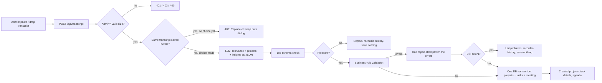

# NullToPlan: what we built, why, and how

This document explains the decisions behind NullToPlan, our AI meeting-to-project CRM. For setup and testing, see the [README](../README.md).

## 1. The problem we set out to solve

After a client meeting, someone has to turn an hour of conversation into a plan: which projects exist, who manages them, which tasks were agreed, who owns each one, when it is due and how long it will take. That work is slow, and it is easy to get wrong in ways that matter: a deadline that was revised later in the meeting, a feature the client rejected, an owner who was changed, a client contact who is not on the team.

Our goal: **an admin gives the system a transcript, and gets back a correct, saved plan that each person can act on, or a clear explanation of what is missing.** Never a confident-looking plan with invented values.

## 2. What we built

| Area | What it does |
| --- | --- |
| Transcript to plan | Paste or drop a transcript. The AI checks relevance, extracts projects and tasks, the server validates every value, and it is saved in one transaction. |
| Meeting insights | Summary, open questions and a suggested agenda for the next meeting. |
| Duplicate handling | The same transcript is detected before calling the AI; the admin chooses Replace or Keep both. |
| Transcript history | Every analysis (saved, not relevant, needs fixes, replaced) with its original text. |
| Role-based views | Dashboard, project pages, My Tasks, Team; each role only sees its own data. |
| Kanban board | Status columns, drag and drop, per-task discussion thread, resource links, audit fields. |
| Editing | Admins and the project's manager edit and delete projects and tasks and reassign developers; only admins reassign managers. |

## 3. How it works

Every read of projects and tasks goes through one module, `src/lib/access.ts`, which takes the server-verified user and scopes the SQL by role.

## 4. Key decisions

### 4.1 One Next.js app instead of a separate frontend and backend
- **Decision:** Next.js 16 App Router with Server Components for pages and route handlers for the API, in one deployable app.
- **Why:** In a hackathon time box, one codebase, one deploy and no CORS removes a whole class of integration problems. Server Components let pages query the database directly through the access layer, so there is no extra API hop or client-side data waterfall for read-only views.
- **Trade-off:** We are tied to Next.js conventions. Client components are used only where interaction needs them (forms, board, drawer, filters).

### 4.2 Plain SQL with an access layer, not an ORM
- **Decision:** `pg` with parameterised SQL. All project/task queries live in `src/lib/access.ts`; each function receives the verified user and applies that role's scope (Admin all, Manager `manager_id = me`, Developer `assignee_id = me`).
- **Why:** Access control is the most important correctness property here, so we wanted it in one readable place that a judge can audit in minutes. SQL fragments are static strings; every value is a bound parameter.
- **Trade-off:** More hand-written SQL. We accepted that to keep the security rules explicit.

### 4.3 Hidden records return 404, not 403
- **Decision:** If a user asks for a project or task they cannot see, the API answers "not found".
- **Why:** A 403 would confirm the record exists. A 404 leaks nothing.

### 4.4 Sessions: signed cookie, but the role always comes from the database
- **Decision:** HS256 JWT in an http-only, SameSite=Lax cookie that holds only the user id. On every request the user and role are re-read from the database.
- **Why:** The client can never claim a different role, and a role change takes effect immediately. No auth library was needed for ten seeded accounts.

### 4.5 The AI proposes, the server decides
- **Decision:** The model returns JSON that is validated twice: first its shape (zod), then business rules in code (real dates, task deadline not after project deadline, positive hours, manager is a Manager, assignee is a Developer, no missing values). If anything fails we give the model **one** repair attempt with the exact errors. If it still fails, **nothing is saved** and the admin sees each problem in plain language.
- **Why:** LLMs are good at reading messy conversation and bad at being reliably exact. Rules that must hold are enforced in code, not trusted to the prompt. All-or-nothing saving (one transaction) means a half-correct plan never reaches the database.
- **Trade-off:** Sometimes the admin has to edit the transcript and resubmit. We prefer an honest "this is missing" to a guess.

### 4.6 Prompt design: final decisions win, never guess
- **Decision:** The system prompt (`src/lib/prompts.ts`) tells the model to use the last agreed value when something is revised, to exclude rejected or deferred work, never to assign people who are not in the directory, to treat hours as developer effort, and to return `null` plus an `unresolved` entry instead of guessing.
- **Why:** These are exactly the traps in real meetings (a deadline moved from 18 to 20 October, an owner changed, a client contact who is not an employee). We read the date from the transcript itself and fall back to today, so relative dates work for any meeting.
- **Flexible input:** The prompt describes many meeting styles (kick-offs, stand-ups, sprint planning, notes without speaker names) so it is not tuned to one transcript.

### 4.7 Relevance check in the same AI call
- **Decision:** The model first judges whether the meeting is about software, IT or technical work. If not, it explains why, and we save nothing.
- **Why:** Feeding a team lunch or an HR meeting into a project planner should not produce fake tasks. Doing the check in the same call (not a second request) keeps latency and quota use down.

### 4.8 Meeting insights and next-meeting agenda
- **Decision:** Alongside tasks, the AI returns a summary, open questions and 3-8 agenda items, each tagged (open question, missing detail, follow-up, risk, decision needed) with a suggested owner. These are shown even when validation fails.
- **Why:** The things that block a plan (an unknown owner, an undecided scope) are exactly what the next meeting should resolve. Turning failures into an agenda makes them useful instead of just errors. We keep `unresolved` (blocks saving) separate from open questions (do not block), so a valid plan is not rejected because someone asked a question.

### 4.9 Provider fallback
- **Decision:** One wrapper (`src/lib/llm.ts`) speaks the OpenAI-compatible API to Gemini, Groq and OpenRouter and tries them in the order set by `LLM_PROVIDER_ORDER`. We run Gemini 2.5 Flash first with OpenRouter as a fallback.
- **Why:** Free-tier quotas and outages are the biggest risk in a live demo. Falling back automatically keeps the demo working; temperature 0 keeps output as stable as possible.

### 4.10 Duplicate transcripts are caught before the AI call
- **Decision:** We store a SHA-256 fingerprint of each transcript (whitespace and case normalised). Re-submitting the same text returns a dialog: **Replace previous** or **Keep both**. Replace deletes the old projects in the same transaction that saves the new ones.
- **Why:** Re-submitting by accident would create duplicate projects and waste AI quota. Asking first costs nothing. Doing the replace inside the save transaction means a failed re-run can never lose the original data. Any real edit (for example changing hours) changes the fingerprint, so edited transcripts are treated as new.

### 4.11 Transcript history records failures too
- **Decision:** Every analysis is recorded with its outcome (Saved, Needs fixes, Not relevant, Replaced), errors, original text and source file name. Replaced runs are marked, not deleted.
- **Why:** The admin can see what was tried, why it failed, and re-run it from the editor. It also makes the AI's behaviour reviewable by a judge.

### 4.12 File drop is read in the browser
- **Decision:** Drag-and-drop and upload accept `.txt`, `.md`, `.vtt` and `.srt`. The file is read client-side into the editable text box; caption timestamps are removed and speaker names kept (`<v Ayesha>` becomes `Ayesha:`).
- **Why:** No file storage or upload endpoint to secure, and the admin can review and edit the text before the AI sees it. Speaker names are kept because the AI needs them to assign owners. PDF/Word are rejected with a clear message rather than parsed badly.

### 4.13 Kanban, threads and audit fields
- **Decision:** Tasks have a status (To do, In progress, In review, Done), created/updated timestamps, reported by, last edited by, resource links and a comment thread. Admins and the project's manager edit everything; the assigned developer moves status, adds links and comments.
- **Why:** A plan is only useful if the team can work from it. Keeping discussion and links on the task keeps context in one place. Permissions follow ownership: managers own the plan, developers own their progress.
- **Note:** The original brief listed progress tracking as out of scope; we added it after the core flow was complete because the team asked for it, and it does not change the transcript flow.

### 4.14 Timeline rules hold after editing too
- **Decision:** A task's deadline can never be after its project's deadline, and a project's deadline cannot move before its latest task. Only Developers can be assignees and only Managers can manage projects.
- **Why:** The same rules the AI must follow apply to humans, so edits cannot make the plan inconsistent.

### 4.15 Versioned migrations that run themselves
- **Decision:** `src/lib/db.ts` holds an ordered list of migrations recorded in `schema_migrations`. They run in one transaction under a Postgres advisory lock, automatically before the first query, and via `npm run db:setup`. Statements are idempotent.
- **Why:** Teammates and the hosted database stay in sync without manual SQL, two server instances cannot apply the same migration twice, and a database created before migrations existed is adopted safely.

### 4.16 UX choices
- **Minimal neutral palette with light and dark themes.** Colour is reserved for meaning (status, deadlines, errors), so it stands out when it matters. Every status also has a text label, so colour is never the only signal. Dark mode uses softened greys and off-white text to avoid glare, with contrast checked against WCAG AA.
- **Instant navigation.** Visited pages are kept in the client cache and quietly refreshed in the background, so going back does not flash a skeleton; the page only changes if the data changed.
- **Every page has loading, empty, error and success states**, submit buttons are disabled while pending, and layouts work from 360px wide with keyboard navigation and visible focus.
- **Progress without false promises.** While the AI runs (10-40 s), the progress steps advance on a timer to show what the server is doing; they are not real progress, and only the actual result decides success or failure.

## 5. What we deliberately did not build

- Signup, password reset and user management: the brief uses ten seeded accounts.
- Storing uploaded files: files are read in the browser instead.
- Real-time collaboration (websockets): threads refresh every 15 seconds, which is enough for a demo and avoids extra infrastructure.
- Any fallback or hard-coded result when the AI fails: if no provider works, the admin sees an error and nothing is saved.

## 6. What we would do next

- Deploy with the hosted database and record the demo video.
- Fuzzy duplicate detection (similar, not just identical, transcripts).
- PDF and Word import, and direct import from meeting tools.
- Preview-before-save, so the admin can adjust the AI's plan before it is written.
- Notifications and real-time updates on task threads.
